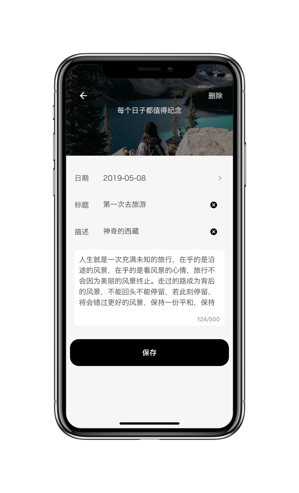
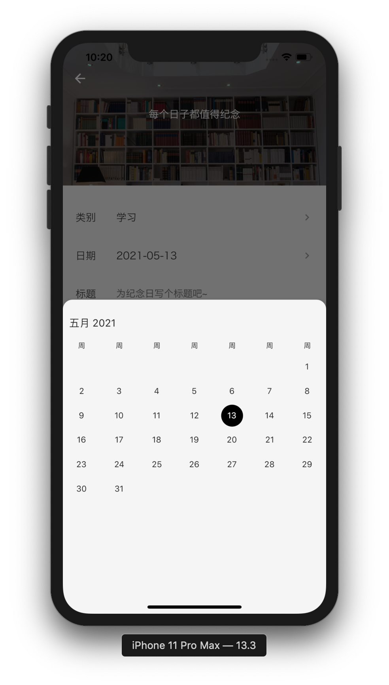

# 时光

> 如果喜欢这款 APP,请点个 🌟🌟 吧

你有没有发现，至今还没有一款界面优美、功能好用的纪念日 APP?   
还在各大 APP 商城找纪念日 APP 心力交瘁？不如来试一试这款 APP 吧！ 

👉[时光 apk](./apk/daliy.apk)


## 预览


|  |  |  |
| :--------------------------------: | :--------------------------------: | :--------------------------------: |
|  |  |  |

## 插件

| 名称                          | 描述         |
| ----------------------------- | ------------ |
| dio                           | 网络请求     |
| oktoast                       | 提示 toast   |
| sqflite                       | 数据持久化   |
| flutter_swiper                | 轮播图       |
| easy_localization             | 国际化       |
| cached_network_image          | 缓存网络图片 |
| syncfusion_flutter_datepicker | 日历选择     |

## 部署

> docker compose 配置文件来自 [猫哥](https://github.com/ducafecat/docker-yapi.git) 提供，在此特此鸣谢

这个项目的接口采用了 mock 接口，来自[Yapi](https://github.com/YMFE/yapi),采用 docker 部署：

```dockerFile
version: '3'
services:
  mongo-yapi:
    image: mongo
    container_name: mongo-ypai
    restart: always
    # ports:
    #   - 27017:27017
    environment:
      - TZ=Asia/Shanghai
      - MONGO_INITDB_DATABASE=yapi
      # - MONGO_INITDB_ROOT_USERNAME=root
      # - MONGO_INITDB_ROOT_PASSWORD=${PASSWORD}
    volumes:
      # - ./docker-data/mongo-yapi:/data/db
      - mongo-data:/data/db
    networks:
      docker_net:
        ipv4_address: 172.22.0.11

  # https://github.com/fjc0k/docker-YApi
  web-yapi:
    image: jayfong/yapi:latest
    container_name: web-ypai
    restart: always
    ports:
      - 9003:3000
    depends_on:
      - mongo-yapi
    links:
      - mongo-yapi
    environment:
      - TZ=Asia/Shanghai
      - YAPI_ADMIN_ACCOUNT=1435398529@qq.com
      - YAPI_ADMIN_PASSWORD=${PASSWORD}
      - YAPI_CLOSE_REGISTER=true
      - YAPI_DB_SERVERNAME=mongo-yapi
      - YAPI_DB_PORT=27017
      - YAPI_DB_DATABASE=yapi
      # - YAPI_DB_USER=root
      # - YAPI_DB_PASS=${PASSWORD}
      - YAPI_MAIL_ENABLE=false
      - YAPI_LDAP_LOGIN_ENABLE=false
      - YAPI_PLUGINS=[]
    networks:
      docker_net:
        ipv4_address: 172.22.0.12

volumes:
  mongo-data:

networks:
  docker_net:
    driver: bridge
    ipam:
      config:
        - subnet: 172.22.0.0/16

```
